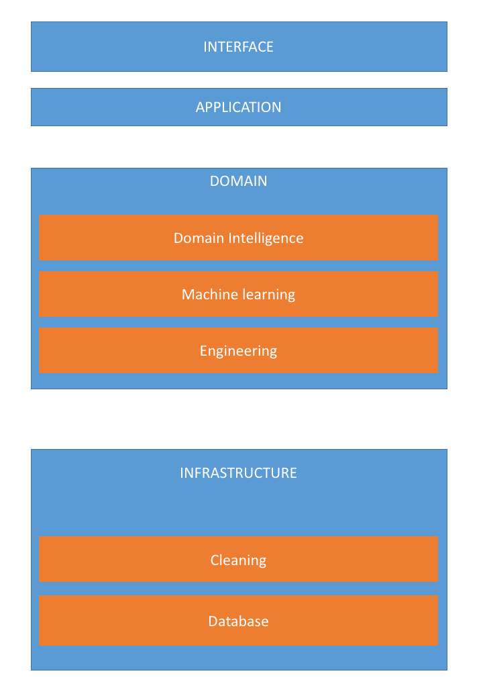

# code_organisation
An example of general code organisation for data science projects. 

## Usage
1. Clone the repository and change the `project_name` directory name
2. Modify the `config/pythonpath.sh`, and source it to add `project_name` to your PYTHONPATH
3. You can now access your functions by importing:

```python
from project_name.domain.subdir.file_name import function_name
```


## Folder structure 
First, the root of your project should separate the documentation, and configuration of your machine from the code itself. README.md contains a short description of your project, while additional documentation lies inside `doc/`. The folder `config/` contains everything related to the local configuration of your machine. The code itself resides in `project_name/` (you should rename it accordingly).

```
├── LICENCE
├── README.md
├── config
│   └── pythonpath.sh
├── doc
└── project_name
    ├── __init__.py
    ├── application
    ├── domain
    ├── infrastructure
    ├── interface
    └── test
        ├── pytest.ini
        └── copy_structure.sh
```

 We turn now to the structure of the `project_name/` directory. As we head toward larger and more complex projects at Quantmetry, I advise to follow a project structure based on Domain Driven Design (DDD, cf [this pdf](http://blog.infosaurus.fr/public/docs/DDDViteFait.pdf)). This approach divides the project in 4 parts:

- infrastructure: link to databases, architecture of data, cleaning and engineering.
- domain: machine learning algorithm, domain intelligence
- application: communication between the different parts
- interface: user interface

where each part should be as isolated as possible.

.

with an additional folder:

- test: test files of your functions

Note that you should *not* put all your data into a separate directory. You should put them along the code that generate them or create a separate folder if multiple analysis are run from them. You can clone directly the complete arborescence from my [github repo](https://github.com/ldocao/code_organisation).


## File names
- Files containing at least one function must have a name starting by a verb, then a noun (or adjective+noun), eg: `search_potential_audience.py`. Otherwise, it must be a noun (or adjective+noun), eg: `constants.py`, `formatted_text.py`.
- You should create one and only one test file per "code" file. They should be named `test_name_of_your_code_file.py`. Folder structure of your `test/` directory must be identical to your `project_name/` directory. 
- Nouns must always be singular unless it would have a specific meaning.
